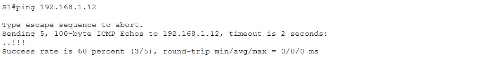
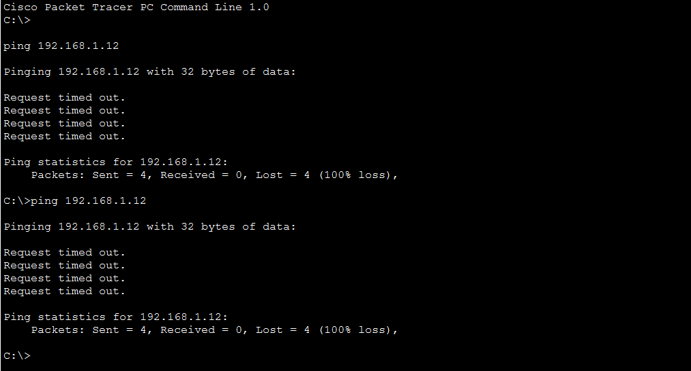
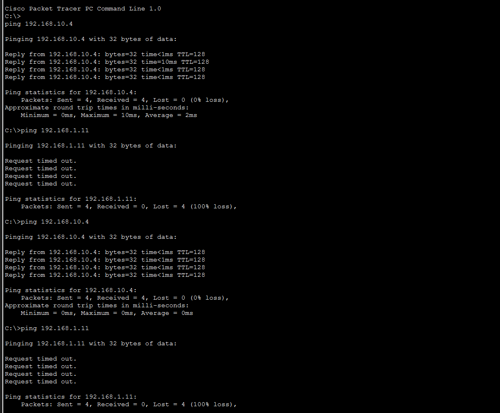

# Praktikum Jaringan Komputer – Konfigurasi VLAN dan Trunking

Dokumentasi hasil uji konektivitas dari konfigurasi VLAN dan Trunking (Physical Mode) di Cisco Packet Tracer.  
Laporan ini menjelaskan hasil pengujian ping dari berbagai perangkat untuk memastikan fungsi VLAN, port access, dan trunk antar switch berjalan dengan benar.

## Deskripsi Singkat
Dalam percobaan ini dilakukan pengujian konektivitas antar perangkat setelah konfigurasi beberapa VLAN dan trunk 802.1Q. Tujuan utamanya adalah untuk memahami bagaimana VLAN memisahkan jaringan, serta bagaimana trunk memungkinkan perangkat dalam VLAN yang sama tetapi berbeda switch dapat berkomunikasi.

## Gambar 1 – Ping dari S1 ke S2

Perintah:
S1# ping 192.168.1.12

Hasil:
Success rate is 60 percent (3/5)

Penjelasan:
Pola "..!!!" menunjukkan bahwa dua echo pertama gagal karena proses ARP (Address Resolution Protocol). Saat S1 pertama kali menghubungi S2 (192.168.1.12), S1 harus mengirim ARP request untuk mengetahui alamat MAC dari IP tujuan. Setelah tabel ARP terisi, tiga paket ICMP berikutnya berhasil dikirim dan mendapatkan balasan. Hal ini normal terjadi pada percobaan pertama ping antar perangkat baru.

Kesimpulan:
Koneksi antar switch (S1 dan S2) melalui VLAN 99 sudah berfungsi dengan baik dan trunk antar switch aktif.

## Gambar 2 – Ping dari PC ke 192.168.1.12

Perintah:
C:\> ping 192.168.1.12

Hasil:
Request timed out.
Request timed out.
Request timed out.
Request timed out.

Penjelasan:
PC berada di VLAN 10 dengan subnet 192.168.10.0/24, sedangkan IP 192.168.1.12 milik VLAN 99 dengan subnet 192.168.1.0/24. Karena tidak ada perangkat Layer 3 seperti router atau multilayer switch untuk melakukan inter-VLAN routing, maka paket ICMP dari VLAN 10 tidak dapat menjangkau VLAN 99. Alamat gateway 192.168.10.1 di PC belum terhubung dengan perangkat apa pun di jaringan.

Kesimpulan:
Ping gagal karena VLAN 10 dan VLAN 99 merupakan jaringan berbeda yang tidak bisa saling berkomunikasi tanpa adanya perangkat routing.

## Gambar 3 – Ping antar PC dan ke Switch

Perintah dan Hasil:
C:\> ping 192.168.10.4   Berhasil
C:\> ping 192.168.1.11   Gagal

Penjelasan:
Ping dari PC-A ke PC-B berhasil 100% karena keduanya berada di VLAN 10 yang sama dan terhubung melalui port trunk antar switch. Sementara itu, ping dari PC ke switch (192.168.1.11) gagal karena berada pada VLAN yang berbeda, yaitu PC di VLAN 10 dan switch di VLAN 99. Tidak ada mekanisme inter-VLAN routing yang menghubungkan kedua VLAN tersebut.

Kesimpulan:
VLAN 10 telah berfungsi dengan baik antar switch, trunk port beroperasi dengan benar, dan VLAN 99 tetap terpisah sebagai VLAN manajemen.

## Ringkasan Hasil Uji Konektivitas
Skenario Uji | Hasil | Penjelasan
------------- | ------ | ------------
S1 → S2 | Berhasil | VLAN 99 aktif dan trunk berfungsi
PC-A → PC-B | Berhasil | Kedua PC berada di VLAN 10 dan trunk antar switch berjalan
PC → S1/S2 (192.168.1.x) | Gagal | Tidak ada inter-VLAN routing antara VLAN 10 dan 99

## Kesimpulan
Berdasarkan hasil pengujian, dapat disimpulkan bahwa konfigurasi VLAN dan trunk telah berhasil diterapkan dengan benar. Koneksi antar switch melalui VLAN 99 dapat berfungsi dengan baik, begitu juga komunikasi antar PC pada VLAN 10 melalui port trunk. Namun, komunikasi antar VLAN (VLAN 10 dan VLAN 99) tidak dapat dilakukan karena tidak ada perangkat Layer 3 yang berfungsi sebagai router. Hal ini menunjukkan bahwa VLAN berperan penting dalam pemisahan jaringan dan keamanan, sedangkan trunk digunakan untuk menghubungkan beberapa VLAN antar perangkat jaringan.
