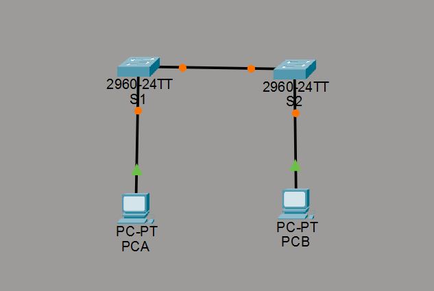

# 💻 Tugas Akhir Praktikum Jaringan Komputer
Repository ini berisi dua project Packet Tracer untuk Tugas Akhir Praktikum Jaringan Komputer.

---

## 🧠 Judul 1: [Basic Switch and End Device Configuration]
📺 **Video Demo:** [Klik di sini](https://youtu.be/Yyd-q-GdEXk)  
🖼️ **Screenshot Topologi:**

📂 **File:**
- `Judul-1/TA-DimasFaqih.pkt`
- `Judul-1/TA1.png`

---

## ⚙️ Judul 2: [Build a Switch and Router Network]
📺 **Video Demo:** [Klik di sini](https://youtu.be/lB-VXLy2GKE)  
🖼️ **Screenshot Topologi:**

📂 **File:**
- `Judul-2/TA_Lab.pkt`
- `Judul-2/TA2.png`

---

## 📁 Struktur Folder
